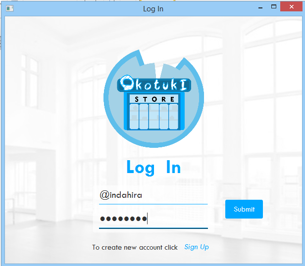
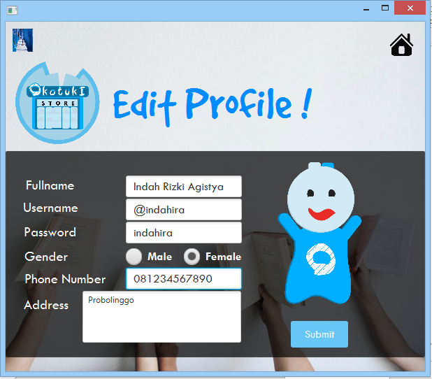
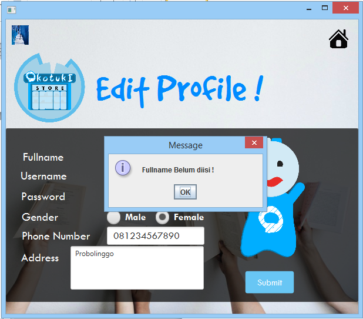

# OkotukI

Deskripsi Tentang Aplikasi:
		Okotuki merupakan aplikasi toko yang menyediakan berbagai barang dalam beberapa kategori. 

Fitur :

1.	Anda dapat mencari berbagai barang dalam beberapa kategori
2.	Anda dapat membuat, mengedit, menghapus dan login akun
3.	Anda dapat membeli barang
4.	Anda dapat menghitung jumlah harga barang yang dicentang

Keunggulan :

>	Tampilan yang user friendly

>	Terdapat penghitung jumlah total harga barang

>	Tersedia berbagai barang dengan harga yang relatif murah dibandingkan dengan toko lainnya

>	Kualitas barang terjamin baik

Run Aplikasi :

>>Ini form untuk update profile

>>Kemudian, jika ada form yang kosong maka akan menampilkan notif seperti dibawah :

 
